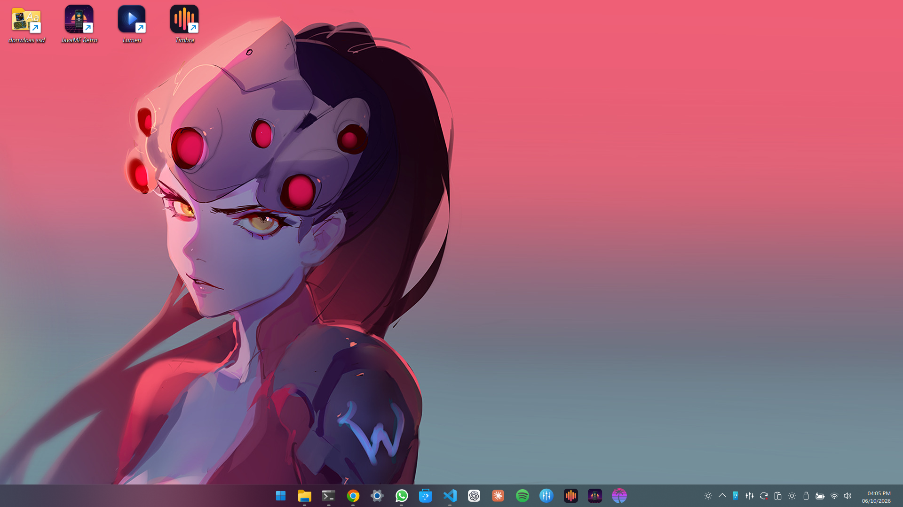
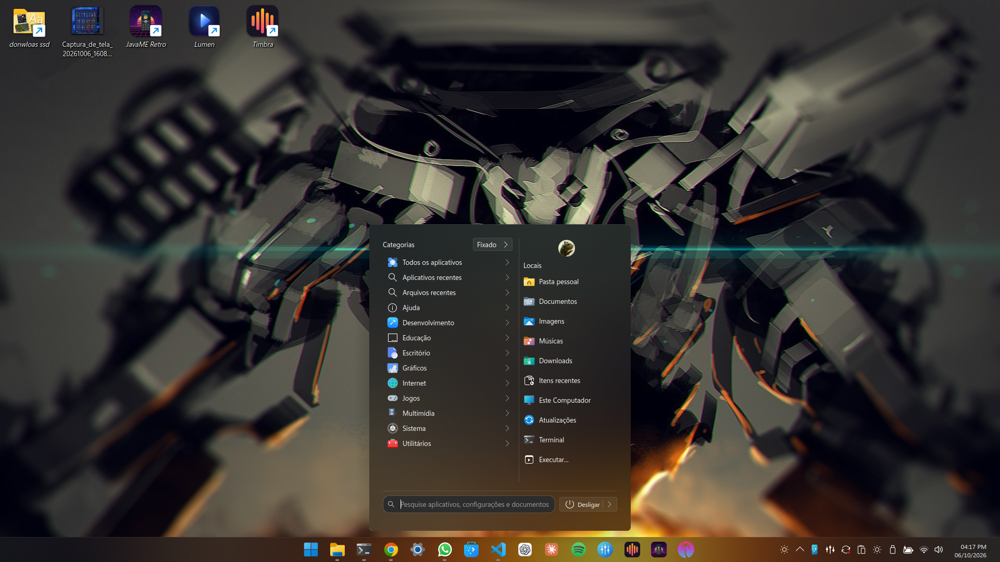

# Plasma W11

Deixa o **KDE Plasma 6** com a cara do **Windows 11** — no modo escuro.





Parte do [KDE-Windows-Modern](https://github.com/Jeysef/KDE-Windows-Modern) (temas,
ícones, menu Iniciar, tela de bloqueio) numa versão fixa e acrescenta:

- **Menu Iniciar** no layout novo do Windows 11: pesquisa no topo, Fixado em grade,
  Recomendado (arquivos recentes) e Todos em Categoria, Grade ou Lista; conta, pastas e
  energia no rodapé. Com animações, tradução pt-BR e "Editar aplicativo…" na pesquisa.
- **Relógio** igual ao do Windows: hora e data do mesmo tamanho, Segoe UI, AM/PM.
- **Bandeja** com a seta `^` à esquerda e a ordem normal dos ícones, **arrastar e soltar**
  para reordenar e **"Alterar ícone…"** no botão direito.
- **Ícones da bandeja** gerados da fonte *Segoe Fluent Icons* do seu Windows — os
  mesmos desenhos do Windows 11, com tamanho óptico uniforme.
- **Cursor Aero e sons** originais, tirados da sua instalação do Windows.
- **Painel acrílico** (translúcido e desfocado) e **bordas arredondadas** de 8 px.
- **Configurações da barra de tarefas** (botão direito no Iniciar, ou pelo menu):
  alinhamento centro/esquerda, ocultar automaticamente, botões pequenos e altura da
  barra, contadores nos apps, combinar janelas, canto de mostrar a área de trabalho,
  transparência e quais ícones da bandeja ficam sempre visíveis — tudo vale na hora.
- **Ícones do painel**: janela para trocar cada ícone da bandeja (por variação —
  play/pause, cada nível de bateria e Wi-Fi…), com tamanho e cor; aceita SVGs da
  Lucide e similares.

## Instalar

```bash
./install.sh
```

O instalador:

1. salva o visual atual (`~/.local/share/plasma-w11/backups/`);
2. instala as dependências (Fedora/dnf) e o efeito de bordas arredondadas (COPR);
3. baixa o KDE-Windows-Modern no commit fixado e aplica `patches/windows-modern.patch`;
4. compila e instala a bandeja (precisa de sudo, vai em `/usr/lib64/qt6/plugins`);
5. procura a partição do Windows (monta só leitura) e extrai fonte de ícones, Segoe UI,
   cursores e sons;
6. aplica tudo e configura o painel mantendo os atalhos fixados da barra atual.

Opções: `--windows <pasta Windows>`, `--no-windows`, `--no-rounded`, `--skip-deps`.

Depois, saia e entre de novo na sessão (a fonte do título das janelas só muda assim).

### Arquivos do Windows

Fonte de ícones, Segoe UI, cursores e sons são da Microsoft e **não fazem parte deste
projeto**: o instalador os lê da sua própria instalação do Windows (dual boot) —
`Windows/Fonts`, `Windows/Cursors` e `Windows/Media`. Sem Windows, o resto funciona
com os ícones do KDE-Windows-Modern, o cursor e os sons padrão.

## Desinstalar

```bash
./uninstall.sh           # volta ao visual salvo antes da instalação
./uninstall.sh --purge   # e também apaga temas, ícones, cursor, sons e a bandeja
```

## Depois de atualizar o Plasma

A bandeja é um plugin compilado; numa atualização grande do Plasma ela pode sumir.
Rode `./install.sh --skip-deps` de novo para recompilar.

## Estrutura

| Caminho | O quê |
|---|---|
| `install.sh`, `uninstall.sh` | instalar / voltar |
| `patches/windows-modern.patch` | alterações sobre o KDE-Windows-Modern (menu, relógio, bandeja) |
| `tools/fluent_icons.py` | gera o tema de ícones da bandeja a partir da Segoe Fluent Icons |
| `tools/windows-cursors.sh`, `tools/windows-sounds.sh` | convertem cursores e sons do Windows |
| `tools/icones-painel` | o utilitário "Ícones do painel" |
| `scripts/` | backup, tema do Plasma, funções comuns |
| `data/` | ajustes do painel, bordas arredondadas, atalho do menu |
| `locale/` | traduções do menu Iniciar |

## Requisitos

Plasma 6 em Wayland, testado no Fedora 44 (Plasma 6.7.5). Em outras distribuições,
instale os equivalentes de: git, kvantum, ImageMagick, gettext, python3-pyside6,
kdialog, cmake, extra-cmake-modules, Qt6 e KF6 *-devel, libplasma e plasma-workspace
*-devel — e rode com `--skip-deps`.

## Licença

GPL-3.0, como o KDE-Windows-Modern. Usa também
[win2xcur](https://github.com/quantum5/win2xcur) e
[KDE-Rounded-Corners](https://github.com/matinlotfali/KDE-Rounded-Corners).
